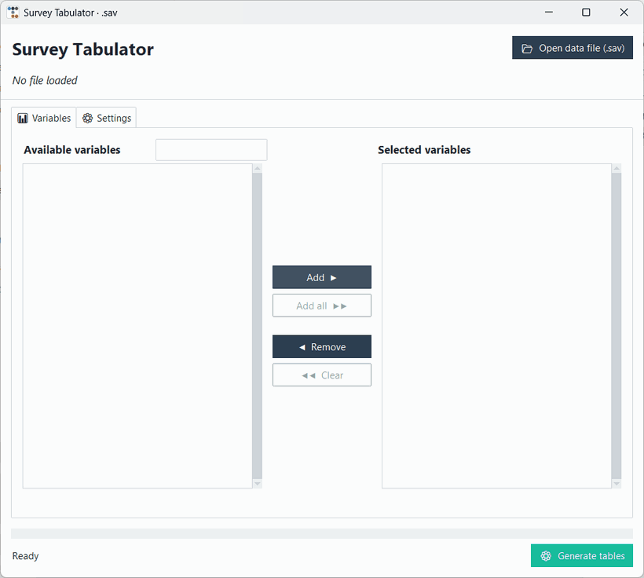
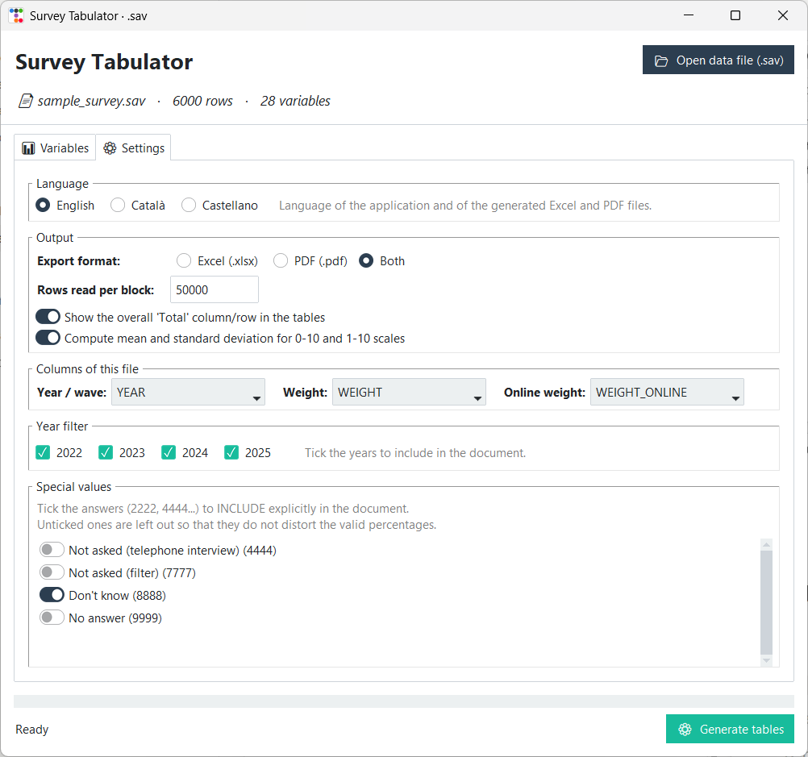
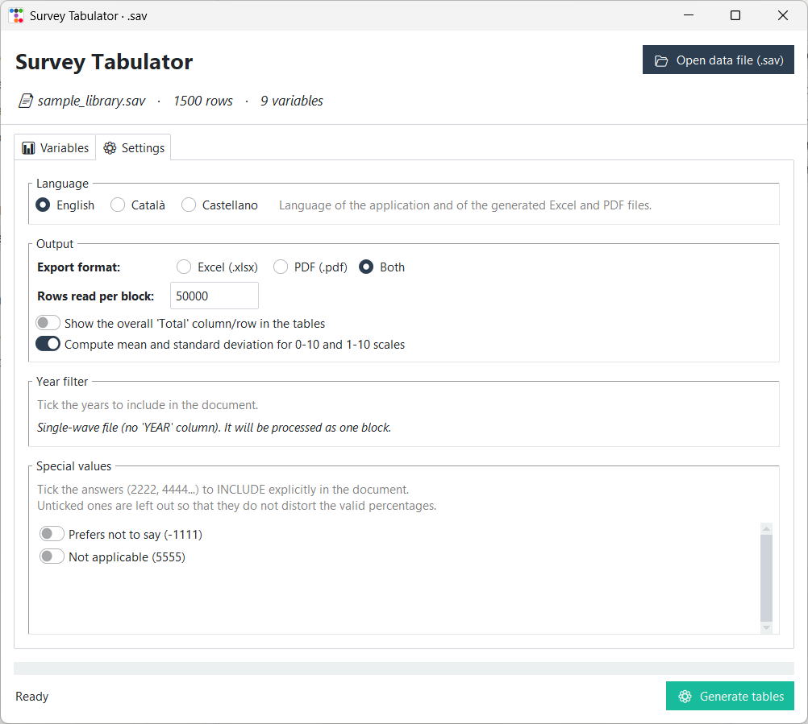
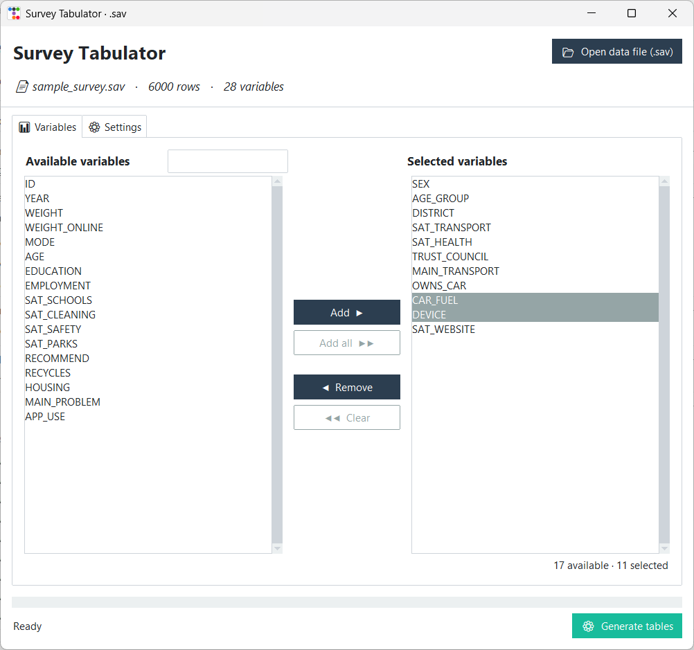
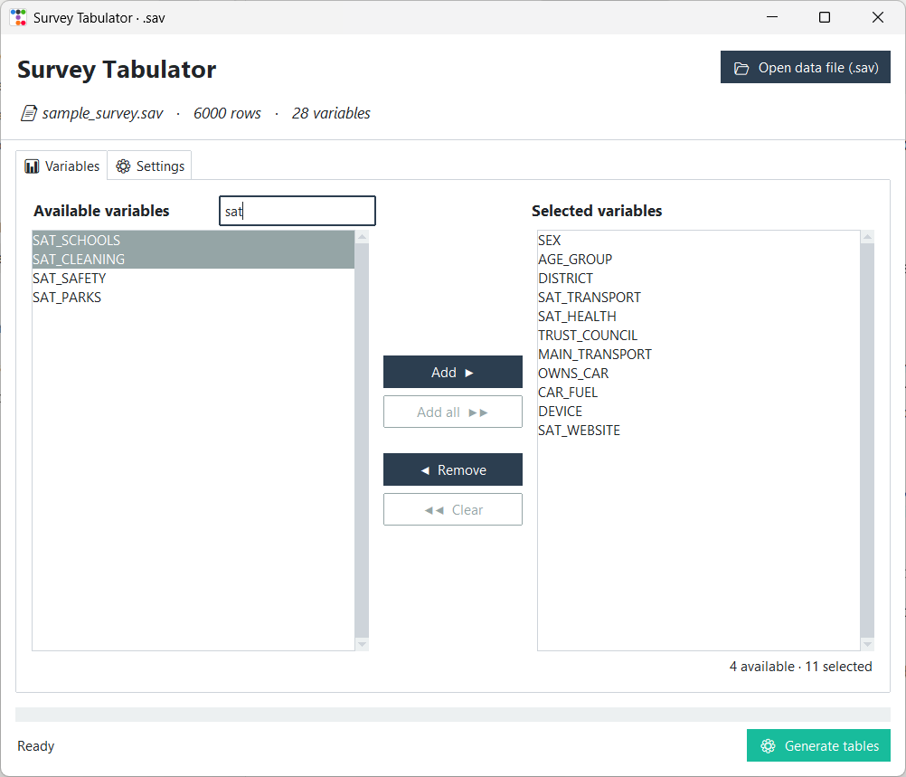
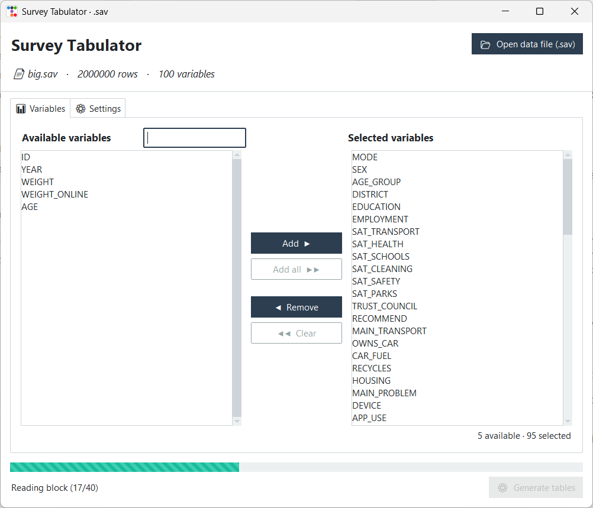
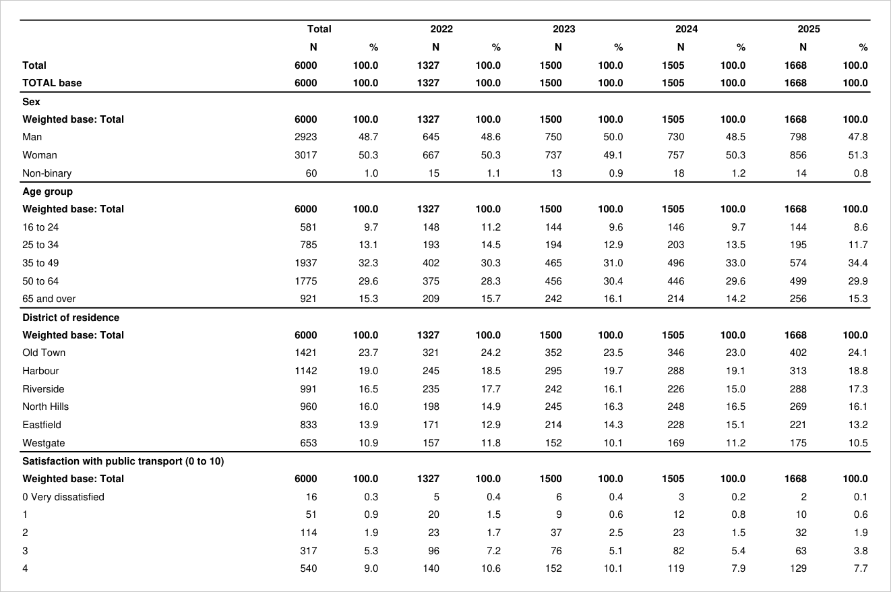
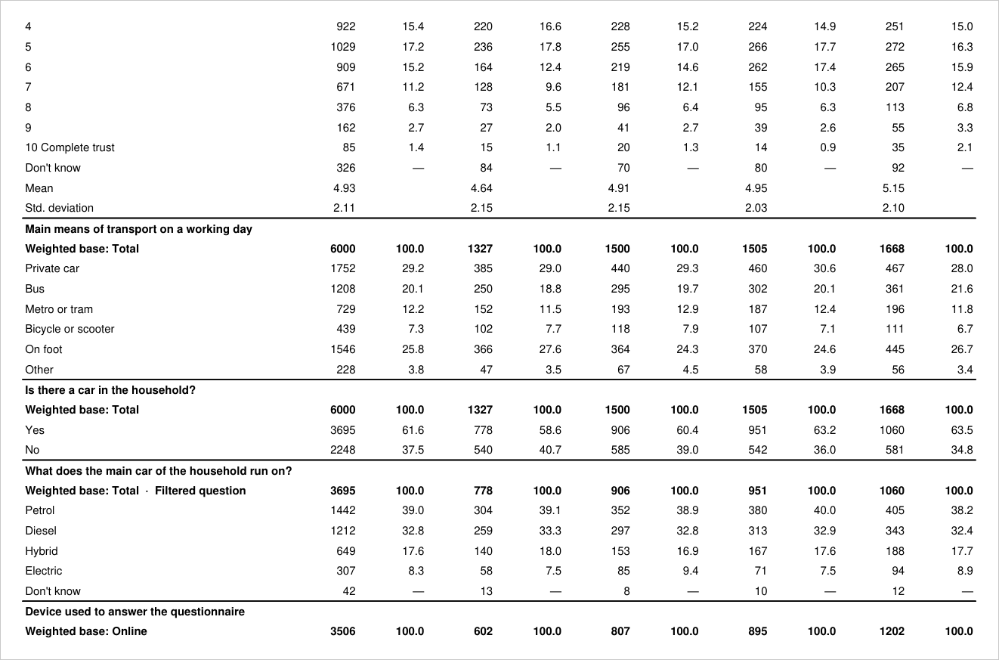
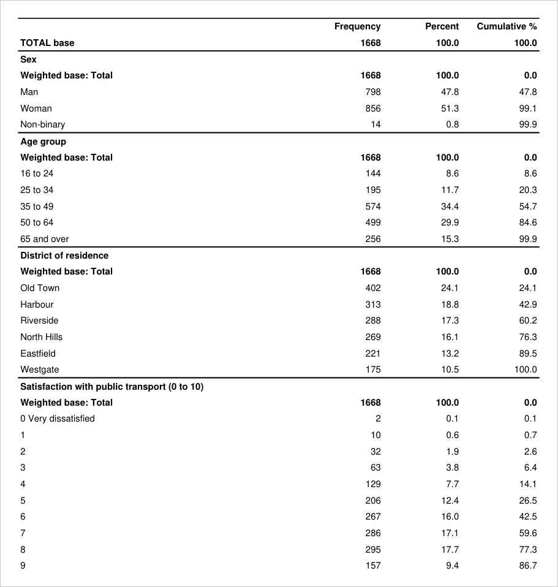
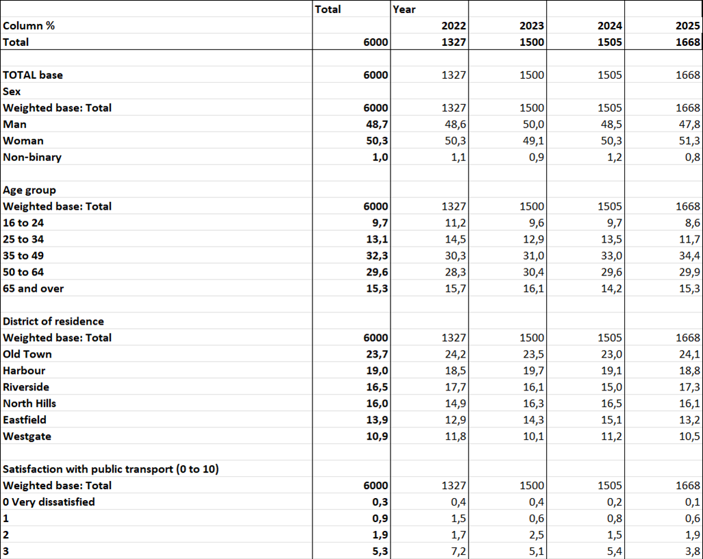

# Survey Tabulator

A desktop application that turns **any** SPSS `.sav` survey file into weighted frequency tables, in
Excel and PDF, without ever loading the file into memory.

- **Nothing is hard-coded for a particular questionnaire.** The window builds itself from the
  dictionary of whatever file is opened: its variables, its labels, its waves and its special codes.
- **The size of the file does not matter.** The data is read in blocks, so a matrix with millions of
  rows is tabulated in a couple of hundred megabytes of RAM.



*The application in use, recorded on the two synthetic files of this repository: search, add and
drag variables into order, adjust the settings, generate the documents, then open a completely
different file and watch the settings rebuild themselves.*

I wrote it in 2026 for the Centre d'Estudis d'Opinió (CEO) of the Generalitat de Catalunya, the
public opinion institute of the Catalan government, as a replacement for Barbwin, the tabulation
program the team was using, which froze on their largest data matrices. This repository is the
English edition of that tool. It contains no CEO data: the files it ships with, and everything shown
in the screenshots, are synthetic surveys generated by a script in this repository.

Python 3 · pandas · [pyreadstat](https://github.com/Roche/pyreadstat) · XlsxWriter · ReportLab ·
Tkinter with [ttkbootstrap](https://ttkbootstrap.readthedocs.io) · packaged with PyInstaller.

## It adapts to any .sav file

The application knows nothing about a survey in advance. A `.sav` file carries its own dictionary,
and everything on screen and in the documents is derived from it when the file is opened:

| Read from the file | What it drives |
| --- | --- |
| Variable names | The two lists and the search box |
| Variable labels | The title of each table |
| Value labels | The rows of each table and their order |
| Wave column, if there is one | One column per year and the year filter; without it, a single-block layout |
| Weight columns, if there are any | Weighted counts and bases; without them, plain counts |
| Special codes used by the value labels | The list of switches in the settings tab |
| Categories numbered 0 to 10 | Which tables get a mean and a standard deviation |
| Value labels that mention a filter | Which questions get a reduced base |

The same window with two unrelated files. On the left, a four-wave weighted survey about city
services; on the right, a single-wave unweighted survey of library users with a different set of
codes. No option was changed by hand: the year filter and the special values are whatever each file
declares.

| `sample_survey.sav`: 4 waves, 28 variables | `sample_library.sav`: 1 wave, 9 variables |
| :---: | :---: |
|  |  |

The only assumptions are a handful of conventions (the names of the wave and weight columns and the
list of codes treated as special), and they are plain constants in
[`src/config.py`](src/config.py), not logic.

## What it does

**1. Choose and order the variables.** Opening a file only reads its dictionary (names, labels and
value labels), so even a very large file is ready at once. Variables are moved between the two lists
with the buttons or by dragging them, several at a time with Ctrl and Shift, and the order of the
right-hand list is the order of the tables in the document. The box above the left list filters by
name as you type.

| Selecting and ordering | Filtering by name |
| :---: | :---: |
|  |  |

**2. Decide what goes into the tables.** The settings tab is filled in from the file itself: the
waves it contains and the special codes its value labels use.

- **Year filter.** A file with a wave column gets one column per year, and any wave can be left out.
  A file without it is tabulated as a single block.
- **Special values.** Codes such as *Don't know*, *No answer* or *Not asked* are left out by default
  so that they do not distort the valid percentages. Each one can be switched back in, in which case
  it is listed at the bottom of the table with its count and no percentage.
- **Mean and standard deviation** for 0-10 and 1-10 rating scales, detected from the categories.
- **Excel, PDF or both**, with or without the overall *Total* column.

**3. Generate.** The work runs in a background thread, so the window stays responsive and reports
the block being read.



## The output

A longitudinal file gives a landscape PDF with the count and the column percentage of every year
side by side:



A later page of the same document shows the cases the tabulation has to get right:



- *Trust in the city council* is a 0-10 scale, so it ends with its **mean and standard deviation**.
  *Don't know* was switched on in the settings, so it is listed, without a percentage.
- *What does the main car of the household run on?* was only asked to households with a car. The
  table is marked as a **filtered question** and its base drops from 6,000 to the 3,695 respondents
  who were actually asked, so the percentages are over them.
- *Device used to answer the questionnaire* only exists in the online questionnaire. It is tabulated
  with the **online weight** over the online base.

A single-wave file (or a single selected year) gives a portrait PDF with a cumulative percentage
instead:

| PDF, single wave | Excel, sheet of column percentages |
| :---: | :---: |
|  |  |

The Excel workbook has two sheets with the same layout, one with the weighted counts and one with
the column percentages, ready to be pasted into a report.

## Why it does not run out of memory

A `.sav` file is compressed on disk and expands many times over when it becomes a DataFrame. Loading
it whole is what makes a large matrix unmanageable. This tool never does that:

1. Only the columns needed for the selected variables are read, 50,000 rows at a time (configurable).
2. Each block is reduced straight away to a few weighted sums per variable, category and year, which
   are added to running totals. Then the block is discarded.
3. The tables are built from those totals at the end, and the Excel file is written in XlsxWriter's
   `constant_memory` mode, row by row.

Memory therefore depends on the block size and on the number of distinct categories, not on the
number of rows.

Measured with `tools/benchmark.py` (which also needs `psutil`) on a synthetic file of 2,000,000 rows and 100 variables (141 MB
on disk), on an AMD Ryzen 5 5600H with 16 GB of RAM and Python 3.13:

| | Time | Peak memory |
| --- | ---: | ---: |
| Tabulate the 95 categorical variables in blocks and write the Excel file | 81 s | **215 MB** |
| Only load the whole file into a DataFrame, tabulating nothing | 23 s | 3,289 MB |

Reading in blocks is slower than a single pass, because each block is decoded and aggregated
separately, but it uses about fifteen times less memory and the figure stays flat as the file grows.

## How the tables are computed

| Rule | Detail |
| --- | --- |
| Counts | Sum of the weighting coefficient of the interviews in each category, rounded to the unit |
| Base | Number of interviews of the wave, minus the weight of those routed past the question |
| Filtered question | A value label containing *filter* marks the respondents who were not asked. They are subtracted from the base and the table is flagged |
| Online-only question | A variable that uses code 4444 is tabulated with the online weight, over the sum of online weights |
| Special codes | 1111, 2222 … 9999 and their negative counterparts are sorted last and get no percentage |
| Category order | By the numeric code in the file, not alphabetically by label |
| Rating scale | At least five categories numbered between 0 and 10; the standard deviation is the sample one |

The column names (`YEAR`, `WEIGHT`, `WEIGHT_ONLINE`), the special codes, the filter keywords and
every label printed in the documents are constants in [`src/config.py`](src/config.py), so the tool
can be pointed at another file layout or translated without touching the tabulation code.

## Download

**[SurveyTabulator.exe](https://github.com/ablesarodriguez/survey-tabulator/releases/latest/download/SurveyTabulator.exe)**
(Windows 10 or 11, 64-bit, about 45 MB). A single file with nothing to install: download it and
double-click. To try it without data of your own, also download
[`sample_survey.sav`](data/sample_survey.sav) and open it from the application.

The executable is not code-signed, so the first time Windows SmartScreen may show "Windows protected
your PC"; choose *More info* and then *Run anyway*. It takes a few seconds to start because it
unpacks itself to a temporary folder. Every version is listed under
[Releases](https://github.com/ablesarodriguez/survey-tabulator/releases).

## Running from source

Requires Python 3.10 or newer.

```bash
pip install -r requirements.txt
```

```bash
python src/app.py
```

Then open `data/sample_survey.sav`, move a few variables to the right and press *Generate tables*.
Open `data/sample_library.sav` afterwards, or any `.sav` of your own, to see the window adapt.
See [data/README.md](data/README.md) for what the sample files contain.

### Building the executable

The CEO team used the tool as a single `.exe` with nothing to install, and the download above is
built the same way. Building it in a fresh virtual environment keeps unrelated packages out of it:

```bash
pip install pyinstaller
```

```bash
pyinstaller --clean survey_tabulator.spec
```

The result is `dist/SurveyTabulator.exe`. If [UPX](https://upx.github.io) is available, adding
`--upx-dir <folder>` makes it smaller.

### Tests

```bash
python -m unittest discover tests
```

The tests tabulate a file of eight interviews whose tables are worked out by hand (weights, bases,
filtered and online-only questions, special codes, scale statistics), check that the result is
identical whatever the block size, and run both exporters end to end on the synthetic survey.

## Repository layout

```
├── src/
│   ├── app.py              the window: file loading, variable lists, settings, worker thread
│   ├── tabulation.py       block-by-block accumulation and the rows of each table
│   ├── excel_export.py     Excel workbook (counts and column percentages)
│   ├── pdf_export.py       PDF document
│   └── config.py           column names, special codes and output labels
├── tools/
│   ├── make_sample_data.py synthetic survey generator
│   └── benchmark.py        time and peak memory, in blocks against loading the whole file
├── tests/
│   └── test_tabulation.py
├── data/
│   ├── sample_survey.sav   synthetic longitudinal survey (see data/README.md)
│   └── sample_library.sav  synthetic single-wave survey with a different layout
├── docs/images/            screenshots and recording used in this README
└── survey_tabulator.spec   PyInstaller recipe
```

## Author and license

Arnau Blesa Rodríguez.

The code is released under the [MIT License](LICENSE).
